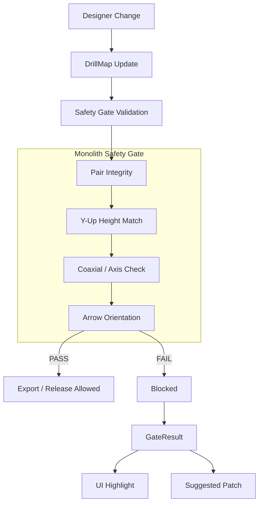

# Monolith Safety Gate System

> **Manufacturing-Safe Validation for Built-in Furniture**
> (Architecture · Geometry · Rules)

---

## 1. What is the Safety Gate?

The Safety Gate is the **last line of defense** between design and manufacturing.

It validates that:

- geometry is correct
- connectors align physically
- drill data is deterministic
- auto-fixes are safe

---

## 2. Contract: Input / Output

```typescript
// INPUT
drillMap: {
  panels: Array<{
    panelId: string;
    points: DrillMapPoint[];
  }>;
}

// OUTPUT
GateResult: {
  gate: string;           // e.g., 'hardware.connector.minifix'
  status: 'PASS' | 'FAIL';
  summary: { totalErrors, totalWarnings, pairsChecked };
  findings: GateFinding[];
}

// PATCH CONTRACT
// - Index found    → deterministic path (e.g., /panels/0/points/3/position/1)
// - Index missing  → patch = [] (error still raised)
// - Duplicate ID   → warning logged, first occurrence used
```

---

## 3. Error Code Quick Reference

| Code | Meaning | Typical Fix |
|------|---------|-------------|
| `MONO_MINIFIX_MISSING_PAIRED_HOLE_ID` | Cam has no pairedHoleId | Regenerate pairing |
| `MONO_MINIFIX_PAIRED_HOLE_NOT_FOUND` | pairedHoleId doesn't resolve | Fix ID reference |
| `MONO_MINIFIX_Y_MISMATCH` | Height mismatch (Y-up) | Patch `position/1` |
| `MONO_MINIFIX_NOT_COAXIAL` | Radial offset > tolerance | Adjust bolt position |
| `MONO_MINIFIX_CAM_AXIS_NOT_NORMAL` | Cam axis not perpendicular | Check panel orientation |
| `MONO_MINIFIX_BOLT_AXIS_NOT_POINTING` | Bolt not pointing at cam | Adjust bolt axis |
| `MONO_MINIFIX_ARROW_NOT_FACING_BOLT` | Cam arrow wrong direction | Rotate cam |
| `MONO_MINIFIX_CLEARANCE_VIOLATION` | Parts too close | Increase spacing |

---

## 4. Safety Gate Flow



---

## 5. DrillMap Structure

```typescript
interface DrillMap {
  panels: Array<{
    panelId: string;
    points: DrillMapPoint[];
  }>;
}

interface DrillMapPoint {
  id: string;
  position: [number, number, number];  // Y-up coordinate
  normal: [number, number, number];
  componentType: 'HOUSING' | 'BOLT';
  purpose: 'MINIFIX' | 'CAM_LOCK' | 'SHELF_PIN';
  pairedHoleId?: string;  // Deterministic pairing
  // ... other fields
}
```

---

## 6. Coordinate System (CRITICAL)

Monolith uses **Y-up** coordinate system (R3F/Three.js standard):

```
      Y (up/height)
      │
      │
      │
      └──────── X
     /
    /
   Z
```

| Axis | Index | Meaning |
|------|-------|---------|
| X | 0 | Horizontal (width) |
| Y | 1 | Vertical (height) |
| Z | 2 | Horizontal (depth) |

```typescript
export const AXIS = {
  X: 0,
  Y: 1,  // Height (vertical) in Y-up system
  Z: 2,
} as const;
```

> Z-up assumptions are invalid in Monolith.

---

## 7. Minifix Rules

### Filter Logic (Standard)

```typescript
// Cam (Housing)
p.componentType === 'HOUSING' &&
(p.purpose === 'MINIFIX' || p.purpose === 'CAM_LOCK')

// Bolt
p.componentType === 'BOLT' &&
(p.purpose === 'MINIFIX' || p.purpose === 'CAM_LOCK')
```

### Constraint Rules

| Rule ID | Name | Severity | Tolerance |
|---------|------|----------|-----------|
| `MONO-MINIFIX-PAIR-001` | Cam must have pairedHoleId | ERROR | - |
| `MONO-MINIFIX-PAIR-002` | pairedHoleId must resolve | ERROR | - |
| `MONO-MINIFIX-AXIS-001` | Cam axis normal to panel | ERROR | 1.0° |
| `MONO-MINIFIX-AXIS-002` | Bolt axis points toward cam | ERROR | 3.0° |
| `MONO-MINIFIX-COAX-001` | Ball center coaxial with cam | ERROR | 0.20mm |
| `MONO-MINIFIX-Y-001` | Ball Y equals cam pocket Y | ERROR | 0.20mm |
| `MONO-MINIFIX-DIAG-003` | BALL_TO_POCKET alignment report | INFO | 0.20mm / 0.20mm |

> **The last two ERROR rules cannot fire in production.**
> `MONO-MINIFIX-COAX-001` and `MONO-MINIFIX-Y-001` both compare the bolt's ball
> centre against the cam pocket centre. Production calls
> `validateMinifixGate(drillMap)` with no options
> (`src/gate/ui/SafetyPanel.tsx:201`), so the ball-centre solve mode is
> `BALL_TO_POCKET`, which assigns `ballCenter = targetCamCenter` verbatim
> (`src/gate/rules/connectors/drillMapToMinifixPair.ts:156-162`). Both rules
> therefore measure exactly **0.00mm** for every pair and can never raise an
> ERROR while that mode is active. See §9.

---

## 8. Index Resolver Layer

### Why it exists

Nested DrillMap → deterministic patch paths.

### Index structure

```typescript
Map<pointId, { panelIdx, pointIdx, panelId }>
```

### Behavior Contract

| Condition | Result |
|-----------|--------|
| Index found | Deterministic patch path |
| Index missing | Error raised, `patch = []` |
| Duplicate ID | Warning logged, first occurrence used |

### Location

```
src/gate/rules/connectors/drillMapIndex.ts
```

---

## 9. Geometry Calculations

### Cam Pocket Center

Two conventions exist in this code. They are **not** interchangeable.

```typescript
// (a) Pair-solver convention — camDepth/2 from the drill face.
//     drillMapToMinifixPair.ts:44-49, :240-245
const pocketCenter = camPos + camNormal * (camDepth / 2);   // 13.5/2 = 6.75mm

// (b) Generator convention — "Dim A" = panelThickness/2.
//     validateMinifixConnector.ts genPocketCenter; generateDrillMap.ts:991-995
const genPocketCenter = camPos + camNormal * (panelThickness / 2);  // 18/2 = 9.0mm
```

(b) is the hardware truth: the physical Minifix cam's bolt channel sits at
dimA = 9mm from the insertion face for 18mm wood
(`minifixDefaults.ts:55` — `camHeight: 9`). Commit `075ceacf` migrated the
`boltDirection` / `targetPocketCenter` cross-checks to (b) because comparing
generator-emitted fields against (a) produced a false warning on **every** pair
of a normal cabinet. The difference is a constant `9.0 − 6.75 = 2.25mm`, and
because the cam normal is perpendicular to the bolt axis in every generated
joint family, it lands entirely in the radial component — 11× the 0.20mm
coaxial tolerance. The BALL_TO_POCKET report below uses (b).

(a) is still what `pair.cam.geometry.pocketCenter` carries and what the ERROR
rules compare against; it was deliberately left alone by `075ceacf` and remains
so. Because production forces `ballCenter = pocketCenter`, this mismatch is
invisible to those rules today.

### Ball Head Center — what actually runs

```typescript
// PRODUCTION (solveMode = BALL_TO_POCKET, the default and the only mode
// production uses — SafetyPanel.tsx:201 passes no options):
ballCenter = targetCamCenter;   // drillMapToMinifixPair.ts:161-162
// The ball centre is ASSIGNED the pocket centre. It is not computed from an
// offset, and the deviation between the two is identically zero by construction.
```

```typescript
// NOT RUN in production (solveMode = FIXED_BALL_OFFSET, tests only):
ballCenter = boltOrigin + boltAxis * ballHeadOffset;   // :169
```

> **`ballHeadOffset = 9.5` has no cited source.** It is a bare default in
> `validateMinifixConnector.ts:867` with no catalogue reference anywhere in this
> repository, and it contradicts the production hardware config, which sets
> `ballHeadOffset: 0` (`src/core/manufacturing/drillMap/minifixDefaults.ts:33`).
> On generator-correct cabinets it does not reach the pocket centre from the
> bolt drill origin, so a fixed-offset solve leaves the ball centre short
> **along the bolt axis** by `distance(boltOrigin, pocketCentre) − 9.5`:
> `24.00 − 9.5 = 14.50mm` on OVERLAY corner and overlay-BACK pairs,
> `15.00 − 9.5 = 5.50mm` on INSET corner pairs (measured, see the table below).
> This is why `FIXED_BALL_OFFSET` is not the active mode, and why no number here
> should be read as a validated engineering value until the offset is sourced.

### Y-Match Validation

```typescript
const deltaY = Math.abs(ballCenterY - camPocketCenterY);
const pass = deltaY <= MINIFIX_TOLERANCES.Y_MISMATCH_MM; // 0.20mm
```

Under `BALL_TO_POCKET` this is always `0.00mm` — see the note under §7.

### BALL_TO_POCKET alignment report (`MONO_MINIFIX_BALL_AUTOCORRECTED_TO_POCKET`)

Because the two ERROR rules are inert in production, this **INFO** finding is
the only thing in `validateMinifixGate` that still measures bolt/cam alignment.
Per pair it reports what a `FIXED_BALL_OFFSET` solve would have measured,
against `genPocketCenter` (convention (b)):

| `measured` key | Meaning | Gated by |
|---|---|---|
| `y_deviation_mm` | `\|B.y − C.y\|` — exactly what `MONO-MINIFIX-Y-001` measures | `Y_MISMATCH_MM` = 0.20mm |
| `radial_deviation_mm` | perpendicular distance from `C` to the bolt axis — exactly what `MONO-MINIFIX-COAX-001` measures | `COAXIAL_RADIAL_MM` = 0.20mm |
| `axial_deviation_mm` | component of `B − C` **along** the bolt axis | **nothing** — no tolerance for it exists in this repo |
| `auto_correction_distance_mm` | full 3-D `‖B − C‖` (retained for existing consumers) | — |

It fires when **either** gated component exceeds its own declared tolerance.
The axial component is reported but never gates: a large 3-D magnitude does not
imply either ERROR rule would have fired.

Severity is **INFO**. Nothing here refuses a cabinet, and it does not make the
ERROR rules able to fire — only changing `solveMode` would, and that is an
owner decision that has not been made.

> **It does not currently reach the Safety Panel.** `SafetyPanel.tsx:260-281`
> maps `gateResult.findings` into the UI for `severity === 'ERROR'` (blockers)
> and `severity === 'WARNING'` (warnings) only; the `info` bucket is populated
> exclusively from the G11 rules, the connector audit and the shadow compare.
> Every INFO produced by `validateMinifixGate` — this one and
> `MONO_MINIFIX_POINT_STATUS_PROPAGATED` — is therefore dropped before display.
> `buildMinifixDiagnosticPayload`, which does carry INFO through, has no caller
> in `src/`. Reaching a user requires a wiring change that has not been made.

On a generator-correct cabinet `radial_deviation_mm` is exactly `0`, because the
generator sets `boltDirection = normalize(pocketCentre − boltOrigin)`, putting
`B` on the axis through `C` by construction. Everything left is the axial
shortfall of the unsourced 9.5mm offset above. Whether it surfaces as a Y
deviation depends only on how the bolt axis is oriented:

Measured on real drill maps from `generateMinifixDrillMap` for a
600 × 720 × 560 / 18mm cabinet (fixtures and assertions in
`src/gate/rules/connectors/__tests__/minifixBallToPocketDiagnostic.spec.ts`):

| Joint family | Pairs | `\|axis.y\|` | origin→pocket | `axial_deviation_mm` | `y_deviation_mm` | `radial_deviation_mm` | Fires? |
|---|---|---|---|---|---|---|---|
| INSET corners | 12 | 0 | 15.00mm | −5.50 | 0.00 | 0.000000 | no |
| OVERLAY corners | 12 | 1 | 24.00mm | −14.50 | 14.50 | 0.000000 | yes |
| Overlay BACK pairs | 6 | 0 | 24.00mm | −14.50 | 0.00 | 0.000000 | no |

The OVERLAY corner number is a property of `ballHeadOffset = 9.5` and of the
bolt axis being vertical there — it is not a property of the cabinet. The same
shortfall exists on INSET and BACK pairs; it simply does not project onto Y, and
no rule gates the axial direction it lives in.

---

## 10. GateResult Structure

```typescript
interface GateResult {
  gate: 'hardware.connector.minifix';
  status: 'PASS' | 'FAIL';
  summary: {
    totalErrors: number;
    totalWarnings: number;
    pairsChecked: number;
  };
  findings: GateFinding[];
}

interface GateFinding {
  severity: 'ERROR' | 'WARNING' | 'INFO';
  code: MinifixConstraintCode;
  message: string;
  entityIds: string[];
  measured?: {
    delta_y_mm?: number;
    radial_offset_mm?: number;
  };
  tolerance?: {
    max_mm?: number;
  };
  suggestedFix?: {
    strategy: string;
    patch: JsonPatch[];
  };
}

interface JsonPatch {
  op: 'replace' | 'add' | 'remove';
  path: string;
  value: any;
}
```

---

## 11. Test Categories

| Test Type | Purpose | File |
|-----------|---------|------|
| Unit | Rule correctness | `validateMinifixGate.spec.ts` |
| Snapshot | Contract stability | `validateMinifixGate.snapshot.spec.ts` |
| Property-based | Edge cases | `validateMinifixGate.property.spec.ts` |
| Multi-pair | Real factory scenarios | `validateMinifixGate.multipair.spec.ts` |

---

## 12. Adding a New Connector

1. Create new rule file under `src/gate/rules/`
2. Define deterministic pairing
3. Implement index resolver if needed
4. Add all 4 test levels
5. Update this document
6. CI must pass

---

## 13. Gate Enforcement Points

| Point | When | Action on Fail |
|-------|------|----------------|
| `DESIGNER_LIVE_DRC` | Real-time in UI | Show warning |
| `EXPORT_PACKET` | Before export | Block export |
| `RELEASE` | Before release | Block release |
| `FACTORY_PACKET_BUILD` | Factory build | Reject packet |

---

## Final Principle

> **If it passes the Safety Gate,
> it must be manufacturable.**

Anything less is a bug.

---

## References

- [CONTRIBUTING.md](../CONTRIBUTING.md) - Development workflow
- [minifixConstraintTypes.ts](../src/gate/rules/connectors/minifixConstraintTypes.ts) - Constraint definitions
- [validateMinifixConnector.ts](../src/gate/rules/connectors/validateMinifixConnector.ts) - Implementation
- [drillMapIndex.ts](../src/gate/rules/connectors/drillMapIndex.ts) - Index resolver
